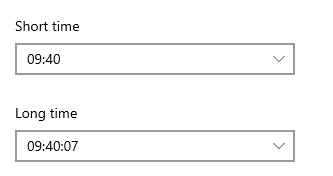

# Silaty

A neat prayer reminder app **(for Windows and Linux)** made in GTK

 
## Installation

[](https://snapcraft.io/silaty)
[](https://snapcraft.io/silaty)
[](https://github.com/LinuxForGeeks/Silaty/releases/download/v1.4/Silaty-1.4-x86_64.AppImage) [](https://github.com/LinuxForGeeks/Silaty/releases/download/v1.4/Silaty-1.4-x86_64.AppImage)

> :warning: Important info for [windows users, scroll down](#windows-configuration).

> :warning: The debian package is outdated, please install using one of the [above packages](#installation) or [from source](#install-from-source-any-linux-distro).

~~### Install using debian package~~

~~Download the [package](https://github.com/AXeL-dev/Silaty/releases/download/v1.3/silaty_1.3_all.deb).~~

~~Install it using apt or any similar tool:~~

<details>
  <summary>Oudated Debian package</summary>
  
```bash
sudo apt install silaty_1.3_all.deb
```
  
</details>

### Install from source (Any Linux Distro)

Download or clone this repository with git:

```bash
git clone https://github.com/AXeL-dev/Silaty.git
```

Make sure that you have all the dependencies installed using the following command:

> :warning: Must install both python deps and package deps

<details open>
  <summary>Python Dependencies</summary>
  
```bash
pip install PySide2 notify.pyu
```

</details>
# Packages
<details open>
  <summary>Ubuntu / Debian</summary>

```bash
sudo apt install gir1.2-gtk-3.0 gir1.2-appindicator3-0.1 gir1.2-notify-0.7 gir1.2-gstreamer-1.0
```

</details>

<details open>
  <summary>Arch Linux</summary>

```bash
pacman -Syu gtk3 libappindicator-gtk3 libnotify gstreamer
```

</details>

**Note:** this command may change depending on your linux distribution.

To install run:

```bash
cd /path/to/silaty
sudo ./install.sh
```

Once installed, you can run Silaty from your applications menu, or using the command bellow:

```bash
silaty-indicator
```

To uninstall run:

```bash
sudo ./uninstall.sh
```

## Windows Configuration

1. How to run:
  * Download the latest zip file, unzip it, find 'silaty-indicator.exe', right-click -> Send to Desktop (Create Shortcut)
  * Rename the desktop shortcut to Silaty (and change icon if you're free to convert silaty.png to .ico lol)

2. How to add on startup:
  * Win+R -> shell:startup
  * Copy the desktop shortcut to the folder
  
3. Change time to 24 clock:
  Settings -> Date & Time -> Date, time & regional formatting -> Change data formats:
    

4. How to enable dark mode:
  * C:/Users/[username]/AppData/Local
  * Create a folder 'gtk-3.0' if it's not there
  * Create a file 'settings.ini' inside of the folder
  * Paste the following and save:
  ```
  [Settings]
  gtk-application-prefer-dark-theme=true
  ```
  
  [Source](https://github.com/Qalculate/qalculate-gtk/issues/18#issuecomment-604860016)
  
## Changelog

### 1.4-updated

- added windows support
- switched most linux-only libraries

### v1.4

- added snap & appimage packages.
- fixed prayer times issues on some locations.

### v1.3

- arabic language is now supported.
- app crash on KDE desktop fixed.

### v1.2

- [Silaty unable to sync prayer times correctly !! #9](https://github.com/Jessewb786/Silaty/issues/9) fixed.
- [Hijri Date #8](https://github.com/Jessewb786/Silaty/issues/8) fixed.
- update home title when stack changes.

### v1.1

- LICENSE added.
- [Add screenshots #3](https://github.com/Jessewb786/Silaty/issues/3).
- README updated.
- attempt to clean code.
- GTK warnings fixed.
- switching between sidebar tabs from indicator menu fixed.
- about tab added/implemented into sidebar.
- fixed a crash when closing the main window.
- [Settings won't open #2](https://github.com/Jessewb786/Silaty/issues/2) fixed.
- load notification icon from its path instead of using an icon name.
- use default layout size, instead of using a fixed window size.
- refresh prayer times on home tab when changing settings.
- useless debug messages commented (especially those used in main loop).
- attempt to fix [installing error #4](https://github.com/Jessewb786/Silaty/issues/4) by ignoring pycompile cmd.
- timezone added to location settings.
- get location using Google Maps API disabled (no longer works).
- daylight saving time setting added.
- display/hide main window from indicator menu fixed.
- location search button added.
- wrong time suffix (AM/PM) when using 12h clock format fixed.
- solve some class naming conflicts.
- [Locations.xml](data/Locations.xml) updated from [libgweather](https://github.com/GNOME/libgweather) repository.
- grabbing timezone from locations xml file done.
- remaining time until next prayer corrected.

### v1.0

- first release

## ToDo

- [x] fix settings issues (especially Location settings).
- [x] use a custom list to get/set location (@see [Minbar](https://github.com/fajran/minbar)).
- [x] remove duplicate locations/cities in [Locations.xml](data/Locations.xml).
- [ ] translate to other languages.

## Credits

- [Jessewb786](https://github.com/Jessewb786)

## License

Silaty is licensed under the [GPL license](LICENSE).
